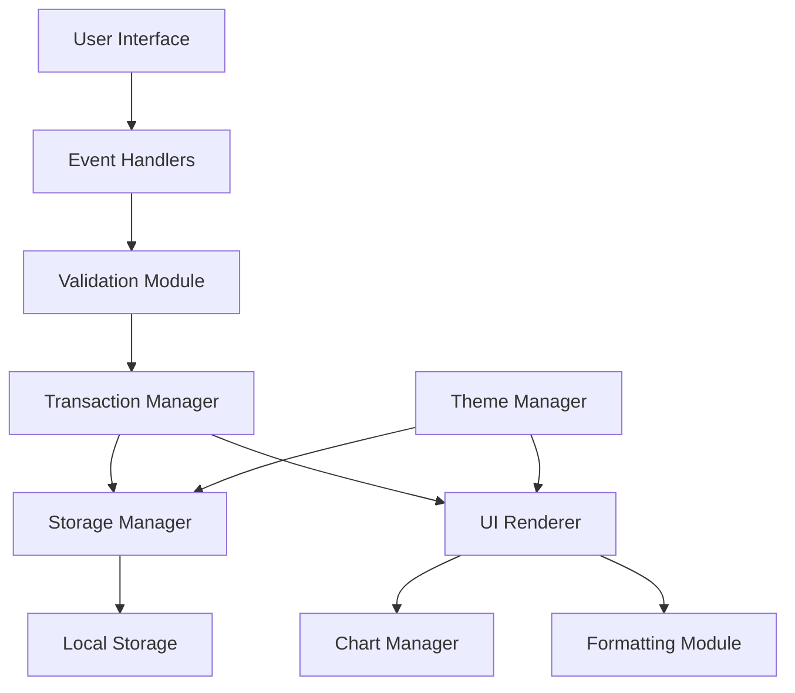

# Design Document: Expense & Budget Visualizer

## Overview

The Expense & Budget Visualizer is a single-page web application built with vanilla JavaScript, HTML5, and CSS3. It provides users with expense tracking capabilities through an intuitive interface that persists data locally in the browser. The application leverages Chart.js for data visualization and implements responsive design principles to ensure usability across devices.

### Key Design Decisions

1. **Vanilla JavaScript Architecture**: No framework dependencies to minimize complexity and bundle size
2. **Local Storage Persistence**: Browser-native storage for zero-latency data access and offline capability
3. **Chart.js Integration**: Industry-standard charting library for reliable, accessible visualizations
4. **Event-Driven Updates**: Centralized update mechanism ensures UI consistency across all operations
5. **CSS-Based Theming**: Media-query-independent dark mode using CSS classes for user control

### Technology Stack

- **Frontend**: HTML5, CSS3, Vanilla JavaScript (ES6+)
- **Visualization**: Chart.js 4.x
- **Storage**: Browser Local Storage API
- **Styling**: Custom CSS with responsive design patterns

## Architecture

### Application Structure

The application follows a functional programming approach with clear separation of concerns:

```
┌─────────────────────────────────────────────────────────┐
│                     User Interface                      │
│  (HTML DOM + CSS Styling + Event Listeners)            │
└──────────────────┬──────────────────────────────────────┘
                   │
                   ▼
┌─────────────────────────────────────────────────────────┐
│              Event Handler Layer                        │
│  • Form submissions                                     │
│  • Button clicks                                        │
│  • Sort option changes                                  │
│  • Theme toggle                                         │
└──────────────────┬──────────────────────────────────────┘
                   │
                   ▼
┌─────────────────────────────────────────────────────────┐
│           Business Logic Layer                          │
│  • Transaction management (add, delete, sort)           │
│  • Balance calculations                                 │
│  • Validation logic                                     │
│  • Currency formatting                                  │
│  • Category aggregation                                 │
└──────────────────┬──────────────────────────────────────┘
                   │
                   ▼
┌─────────────────────────────────────────────────────────┐
│            Data Persistence Layer                       │
│  • Local Storage read/write                             │
│  • JSON serialization/deserialization                   │
└──────────────────┬──────────────────────────────────────┘
                   │
                   ▼
┌─────────────────────────────────────────────────────────┐
│         Rendering/Presentation Layer                    │
│  • DOM manipulation                                     │
│  • Chart updates (Chart.js)                             │
│  • Theme application                                    │
└─────────────────────────────────────────────────────────┘
```

### Data Flow

```
User Action → Event Handler → Validation → State Update → 
Persistence → Render Update (DOM + Chart)
```

The application maintains a single source of truth in the `transactions` array, which is synchronized with Local Storage on every mutation. All UI updates flow through the centralized `updateApp()` function to ensure consistency.

## Components and Interfaces

### Core Modules

#### 1. Transaction Manager

**Responsibility**: Manages the lifecycle of expense transactions

**Public Interface**:
```javascript
// Add a new transaction
function addTransaction(itemName: string, amount: number, category: string): void

// Remove a transaction by ID
function deleteTransaction(id: number): void

// Sort transactions based on criteria
function sortTransactions(sortOption: SortOption): void

// Calculate total balance
function calculateTotal(transactions: Transaction[]): number
```

**Internal State**:
```javascript
let transactions: Transaction[] = []
```

#### 2. Storage Manager

**Responsibility**: Handles all Local Storage operations

**Public Interface**:
```javascript
// Save transactions to Local Storage
function saveTransactions(transactions: Transaction[]): void

// Load transactions from Local Storage
function loadTransactions(): Transaction[]

// Save spending limit
function saveSpendingLimit(limit: number): void

// Load spending limit
function loadSpendingLimit(): number

// Save theme preference
function saveTheme(isDark: boolean): void

// Load theme preference
function loadTheme(): boolean
```

#### 3. Validation Module

**Responsibility**: Validates user inputs before processing

**Public Interface**:
```javascript
// Validate transaction form inputs
function validateTransaction(name: string, amount: number, category: string): ValidationResult

// Validate spending limit input
function validateSpendingLimit(limit: number): ValidationResult

interface ValidationResult {
    isValid: boolean
    errorMessage: string | null
}
```

#### 4. Formatting Module

**Responsibility**: Formats data for display

**Public Interface**:
```javascript
// Format currency amounts in IDR
function formatCurrency(amount: number): string

// Format dates/timestamps
function formatDate(timestamp: number): string
```

#### 5. Chart Manager

**Responsibility**: Manages Chart.js visualization

**Public Interface**:
```javascript
// Update pie chart with current transaction data
function updateChart(transactions: Transaction[]): void

// Calculate category totals
function calculateCategoryTotals(transactions: Transaction[]): CategoryTotals

// Destroy existing chart instance
function destroyChart(): void
```

**Internal State**:
```javascript
let expenseChart: Chart | null = null
```

#### 6. UI Renderer

**Responsibility**: Updates DOM elements based on application state

**Public Interface**:
```javascript
// Render transaction list
function displayTransactions(transactions: Transaction[]): void

// Update total balance display
function updateTotalBalance(total: number): void

// Update spending limit status
function updateLimitStatus(limit: number, total: number): void

// Apply theme to UI
function applyTheme(isDarkMode: boolean): void
```

#### 7. Theme Manager

**Responsibility**: Handles theme switching

**Public Interface**:
```javascript
// Toggle between dark and light mode
function toggleTheme(): void

// Apply theme classes to body
function updateTheme(isDark: boolean): void
```

### Component Interaction Diagram



## Data Models

### Transaction

Represents a single expense entry.

```typescript
interface Transaction {
    id: number;           // Unique identifier (timestamp)
    name: string;         // Item name (trimmed, non-empty)
    amount: number;       // Amount in IDR (positive number)
    category: Category;   // Expense category
}
```

**Constraints**:
- `id`: Must be unique, generated using `Date.now()`
- `name`: Non-empty string after trimming whitespace
- `amount`: Positive number (> 0)
- `category`: Must be one of the predefined categories

### Category

Enumeration of available expense categories.

```typescript
type Category = 'Food' | 'Transport' | 'Fun';
```

**Fixed Categories**:
- Food: Food and beverage expenses
- Transport: Transportation costs
- Fun: Entertainment and leisure spending

### SortOption

Defines available sorting methods for transactions.

```typescript
type SortOption = 'newest' | 'amount-high' | 'amount-low' | 'category';
```

**Sort Behaviors**:
- `newest`: Descending by ID (most recent first)
- `amount-high`: Descending by amount (highest first)
- `amount-low`: Ascending by amount (lowest first)
- `category`: Alphabetical by category name

### CategoryTotals

Aggregated spending amounts by category.

```typescript
interface CategoryTotals {
    Food: number;
    Transport: number;
    Fun: number;
}
```

### ApplicationState

Complete application state structure.

```typescript
interface ApplicationState {
    transactions: Transaction[];
    spendingLimit: number;          // 0 indicates not set
    darkMode: boolean;
    currentSort: SortOption;
}
```

### Local Storage Schema

**Storage Keys**:
- `transactions`: Serialized Transaction array as JSON string
- `spendingLimit`: Number stored as string
- `darkMode`: Boolean stored as string ("true" or "false")

**Example Local Storage Contents**:
```json
{
    "transactions": "[{\"id\":1704067200000,\"name\":\"Lunch\",\"amount\":25000,\"category\":\"Food\"}]",
    "spendingLimit": "1000000",
    "darkMode": "true"
}
```

## Correctness Properties

*A property is a characteristic or behavior that should hold true across all valid executions of a system—essentially, a formal statement about what the system should do. Properties serve as the bridge between human-readable specifications and machine-verifiable correctness guarantees.*

### Property 1: Transaction Serialization Round-Trip

*For any* valid transaction array, serializing to JSON and then deserializing should produce an equivalent array with the same transaction data.

**Validates: Requirements 2.5, 2.6**

### Property 2: Balance Calculation Consistency

*For any* non-empty transaction array, the sum of individual transaction amounts should equal the calculated total balance.

**Validates: Requirements 5.1, 5.2, 5.3**

### Property 3: Sort Stability

*For any* transaction array and sort option, sorting should preserve all transaction data (no data loss) and maintain the specified ordering relationship between elements.

**Validates: Requirements 6.1, 6.2, 6.3, 6.4, 6.6**

### Property 4: Category Aggregation Completeness

*For any* transaction array, the sum of all category totals should equal the total balance.

**Validates: Requirements 7.4**

### Property 5: Currency Formatting Consistency

*For any* valid number, formatting as currency should produce a string containing the number's value with proper IDR formatting (thousand separators, no decimal places).

**Validates: Requirements 3.3**

### Property 6: Spending Limit Comparison

*For any* total balance and spending limit (where limit > 0), the limit exceeded status should be true if and only if the balance is strictly greater than the limit.

**Validates: Requirements 8.6, 8.7**

### Property 7: Transaction ID Uniqueness

*For any* sequence of transaction additions, all generated transaction IDs should be unique within the transaction array.

**Validates: Requirements 1.1, 4.5**

### Property 8: Sort Order Preservation

*For any* sorted transaction array using "newest" ordering, for all adjacent pairs, the first element's ID should be greater than or equal to the second element's ID.

**Validates: Requirements 6.1**

### Property 9: Category Total Non-Negativity

*For any* transaction array, all calculated category totals should be non-negative (>= 0).

**Validates: Requirements 7.4**

## Error Handling

### Validation Errors

**Strategy**: Fail-fast with user feedback

1. **Empty Field Validation**
   - Check: All required fields contain non-empty values
   - Response: Display alert "Please fill in all fields."
   - Action: Prevent form submission

2. **Amount Validation**
   - Check: Amount is a positive number (> 0)
   - Response: Display alert "Amount must be greater than 0."
   - Action: Prevent form submission

3. **Spending Limit Validation**
   - Check: Limit is a positive number (> 0)
   - Response: Display alert "Please enter a valid spending limit."
   - Action: Prevent limit update

### Local Storage Errors

**Strategy**: Graceful degradation

1. **Storage Quota Exceeded**
   - Detection: Catch `QuotaExceededError` during `localStorage.setItem()`
   - Response: Display alert warning user of storage limitations
   - Fallback: Continue with in-memory state only

2. **Storage Access Denied**
   - Detection: Check `localStorage` availability at initialization
   - Response: Display warning message about disabled persistence
   - Fallback: Run in memory-only mode

3. **JSON Parsing Errors**
   - Detection: Catch `SyntaxError` during `JSON.parse()`
   - Response: Log error to console
   - Fallback: Initialize with empty state

### Chart Rendering Errors

**Strategy**: Silent recovery

1. **Chart.js Load Failure**
   - Detection: Check for `Chart` global at initialization
   - Response: Log error to console
   - Fallback: Hide chart section, continue without visualization

2. **Canvas Context Error**
   - Detection: Try-catch around `new Chart()` call
   - Response: Log error to console
   - Fallback: Display message "Chart unavailable"

### Implementation Pattern

```javascript
// Validation with error feedback
function validateAndAdd() {
    try {
        const result = validateTransaction(name, amount, category);
        if (!result.isValid) {
            alert(result.errorMessage);
            return;
        }
        // Proceed with addition
    } catch (error) {
        console.error('Validation error:', error);
        alert('An unexpected error occurred.');
    }
}

// Storage with fallback
function saveWithFallback() {
    try {
        localStorage.setItem(key, value);
    } catch (error) {
        if (error.name === 'QuotaExceededError') {
            alert('Storage limit reached. Data may not persist.');
        }
        console.error('Storage error:', error);
    }
}

// Chart with graceful degradation
function renderChartSafely() {
    try {
        if (typeof Chart === 'undefined') {
            console.warn('Chart.js not loaded');
            return;
        }
        updateChart(transactions);
    } catch (error) {
        console.error('Chart rendering error:', error);
    }
}
```

## Testing Strategy

### Unit Tests

**Focus Areas**:
1. **Validation Logic**
   - Test empty string rejection
   - Test zero/negative amount rejection
   - Test whitespace trimming
   - Test valid input acceptance

2. **Calculation Functions**
   - Test balance calculation with various transaction sets
   - Test category aggregation with different distributions
   - Test currency formatting with edge cases (0, large numbers, decimals)

3. **Sorting Logic**
   - Test each sort option with known transaction sets
   - Test sort with empty array
   - Test sort with single element
   - Test sort with duplicate values

4. **Theme Management**
   - Test theme toggle state changes
   - Test theme persistence
   - Test theme application to DOM

5. **Transaction Management**
   - Test transaction addition with valid inputs
   - Test transaction deletion by ID
   - Test ID uniqueness across additions

**Testing Library**: Jest or Vitest for vanilla JavaScript testing

### Property-Based Tests

**Library Selection**: fast-check (JavaScript property-based testing library)

**Configuration**: Minimum 100 iterations per property test

**Test Implementation**:

```javascript
import fc from 'fast-check';

// Property 1: Serialization round-trip
test('Transaction serialization round-trip preserves data', () => {
    // Feature: expense-budget-visualizer, Property 1: Transaction Serialization Round-Trip
    fc.assert(
        fc.property(fc.array(transactionArbitrary()), (transactions) => {
            const serialized = JSON.stringify(transactions);
            const deserialized = JSON.parse(serialized);
            expect(deserialized).toEqual(transactions);
        }),
        { numRuns: 100 }
    );
});

// Property 2: Balance calculation consistency
test('Balance equals sum of all transaction amounts', () => {
    // Feature: expense-budget-visualizer, Property 2: Balance Calculation Consistency
    fc.assert(
        fc.property(fc.array(transactionArbitrary()), (transactions) => {
            const expectedTotal = transactions.reduce((sum, t) => sum + t.amount, 0);
            const actualTotal = calculateTotal(transactions);
            expect(actualTotal).toBe(expectedTotal);
        }),
        { numRuns: 100 }
    );
});

// Property 3: Sort stability
test('Sorting preserves all transaction data', () => {
    // Feature: expense-budget-visualizer, Property 3: Sort Stability
    fc.assert(
        fc.property(
            fc.array(transactionArbitrary()),
            fc.constantFrom('newest', 'amount-high', 'amount-low', 'category'),
            (transactions, sortOption) => {
                const original = [...transactions];
                sortTransactions(sortOption);
                expect(transactions).toHaveLength(original.length);
                // Verify all original transactions still exist (by ID)
                original.forEach(t => {
                    expect(transactions.find(x => x.id === t.id)).toBeDefined();
                });
            }
        ),
        { numRuns: 100 }
    );
});

// Property 4: Category aggregation completeness
test('Sum of category totals equals total balance', () => {
    // Feature: expense-budget-visualizer, Property 4: Category Aggregation Completeness
    fc.assert(
        fc.property(fc.array(transactionArbitrary()), (transactions) => {
            const categoryTotals = calculateCategoryTotals(transactions);
            const sumOfCategories = categoryTotals.Food + 
                                   categoryTotals.Transport + 
                                   categoryTotals.Fun;
            const totalBalance = calculateTotal(transactions);
            expect(sumOfCategories).toBe(totalBalance);
        }),
        { numRuns: 100 }
    );
});

// Property 5: Currency formatting consistency
test('Currency formatting preserves numeric value', () => {
    // Feature: expense-budget-visualizer, Property 5: Currency Formatting Consistency
    fc.assert(
        fc.property(fc.nat(10000000), (amount) => {
            const formatted = formatCurrency(amount);
            // Should contain the amount's digits
            const digitsOnly = formatted.replace(/\D/g, '');
            expect(parseInt(digitsOnly)).toBe(amount);
        }),
        { numRuns: 100 }
    );
});

// Property 6: Spending limit comparison
test('Limit exceeded status matches comparison logic', () => {
    // Feature: expense-budget-visualizer, Property 6: Spending Limit Comparison
    fc.assert(
        fc.property(
            fc.nat(10000000),
            fc.nat(10000000),
            (balance, limit) => {
                fc.pre(limit > 0); // Only test with valid limits
                const isOverLimit = isSpendingLimitExceeded(balance, limit);
                expect(isOverLimit).toBe(balance > limit);
            }
        ),
        { numRuns: 100 }
    );
});

// Property 7: Transaction ID uniqueness
test('Generated transaction IDs are unique', () => {
    // Feature: expense-budget-visualizer, Property 7: Transaction ID Uniqueness
    fc.assert(
        fc.property(
            fc.array(fc.tuple(fc.string(), fc.nat(1000000), categoryArbitrary())),
            (transactionInputs) => {
                const transactions = [];
                transactionInputs.forEach(([name, amount, category]) => {
                    const id = Date.now() + transactions.length; // Simulate ID generation
                    transactions.push({ id, name, amount, category });
                });
                const ids = transactions.map(t => t.id);
                const uniqueIds = new Set(ids);
                expect(uniqueIds.size).toBe(ids.length);
            }
        ),
        { numRuns: 100 }
    );
});

// Property 8: Sort order preservation (newest)
test('Newest sort maintains descending ID order', () => {
    // Feature: expense-budget-visualizer, Property 8: Sort Order Preservation
    fc.assert(
        fc.property(fc.array(transactionArbitrary()), (transactions) => {
            transactions.sort((a, b) => b.id - a.id);
            for (let i = 0; i < transactions.length - 1; i++) {
                expect(transactions[i].id).toBeGreaterThanOrEqual(transactions[i + 1].id);
            }
        }),
        { numRuns: 100 }
    );
});

// Property 9: Category total non-negativity
test('Category totals are never negative', () => {
    // Feature: expense-budget-visualizer, Property 9: Category Total Non-Negativity
    fc.assert(
        fc.property(fc.array(transactionArbitrary()), (transactions) => {
            const categoryTotals = calculateCategoryTotals(transactions);
            expect(categoryTotals.Food).toBeGreaterThanOrEqual(0);
            expect(categoryTotals.Transport).toBeGreaterThanOrEqual(0);
            expect(categoryTotals.Fun).toBeGreaterThanOrEqual(0);
        }),
        { numRuns: 100 }
    );
});

// Arbitrary generators
function transactionArbitrary() {
    return fc.record({
        id: fc.nat(),
        name: fc.string({ minLength: 1 }),
        amount: fc.nat(10000000).filter(n => n > 0),
        category: categoryArbitrary()
    });
}

function categoryArbitrary() {
    return fc.constantFrom('Food', 'Transport', 'Fun');
}
```

### Integration Tests

**Focus Areas**:
1. **End-to-End Flows**
   - Add transaction → Verify in list → Delete → Verify removal
   - Set spending limit → Add transactions → Verify warning display
   - Toggle theme → Verify persistence after reload

2. **Local Storage Integration**
   - Test data persistence across page reloads
   - Test handling of corrupted storage data
   - Test storage quota handling

3. **Chart.js Integration**
   - Test chart updates after transaction changes
   - Test chart destruction and recreation
   - Test chart with empty data

**Testing Environment**: Playwright or Puppeteer for browser automation

### Manual Testing

**Test Cases**:
1. Responsive design at various viewport sizes
2. Theme appearance consistency across all components
3. Chart visual accuracy against transaction data
4. Form validation user feedback clarity
5. Accessibility with screen readers

### Test Data Generators

Create fixtures for common test scenarios:

```javascript
// Test data builders
function createTransaction(overrides = {}) {
    return {
        id: Date.now(),
        name: 'Test Item',
        amount: 10000,
        category: 'Food',
        ...overrides
    };
}

function createTransactionSet(count, categoryDistribution = {}) {
    const transactions = [];
    const categories = ['Food', 'Transport', 'Fun'];
    
    for (let i = 0; i < count; i++) {
        transactions.push({
            id: Date.now() + i,
            name: `Item ${i}`,
            amount: Math.floor(Math.random() * 100000),
            category: categories[i % categories.length]
        });
    }
    
    return transactions;
}
```

### Testing Best Practices

1. **Test Pure Functions First**: Focus property-based tests on calculation and transformation logic
2. **Mock Storage APIs**: Use mocks for Local Storage in unit tests
3. **Stub Chart.js**: Mock Chart.js in unit tests to avoid canvas dependencies
4. **Test Edge Cases**: Empty arrays, single elements, maximum values
5. **Test Error Paths**: Invalid inputs, storage failures, parsing errors
6. **Maintain Test Isolation**: Each test should reset state and not depend on others

